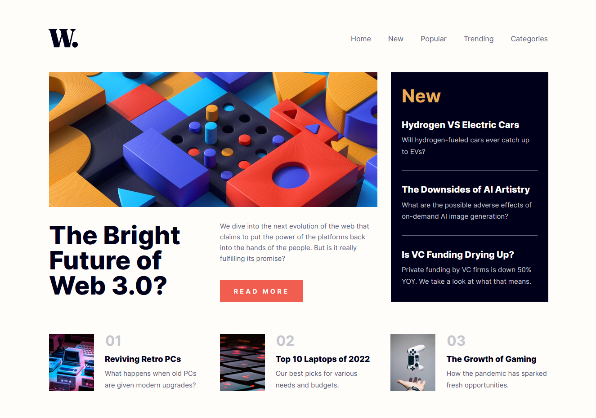

# Frontend Mentor - News homepage solution

This is a solution to the [News homepage challenge on Frontend Mentor](https://www.frontendmentor.io/challenges/news-homepage-H6SWTa1MFl). Frontend Mentor challenges help you improve your coding skills by building realistic projects. 

## Table of contents

- [Overview](#overview)
  - [The challenge](#the-challenge)
  - [Screenshot](#screenshot)
  - [Links](#links)
- [Built with](#built-with)
- [Author](#author)

## Overview

### The challenge

Users should be able to:

- View the optimal layout for the interface depending on their device's screen size
- See hover and focus states for all interactive elements on the page

### Screenshot

### Links

- Solution URL: [Frontend Mentor Solution](https://www.frontendmentor.io/solutions/news-homepage-using-react-Sg5Vd1-6Uy)
- Live Site URL: [Live Site](https://resplendent-seahorse-54dcc0.netlify.app/)

## Built with

- Semantic HTML5 markup
- CSS custom properties
- Flexbox
- Mobile-first workflow
- [React](https://reactjs.org/) - JS library

## Author

- Frontend Mentor - [@pawelpiotrowski38](https://www.frontendmentor.io/profile/pawelpiotrowski38)
